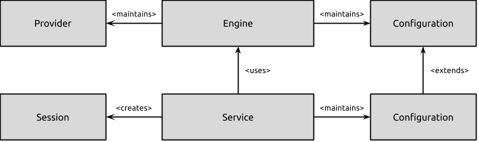

# Introduction               {#mainpage}

Ubuntu's location service is a central hub for multiplexing access to
positioning subsystems available via hard- and software. It provides a
client API offering positioning capabilities to applications and other
system components, abstracting away the details of individual
positioning solutions.

## Vocabulary

To make the remainder of this documentation as easily understandable
as possible, we start over with introducing some vocabulary:

- Engine: 
    Responsible for handling input from multiple positioning
    subsystems and maintaining the state of the overall system. Think
    about it like the heart of the system.

- Provider: 
    A positioning subsystem that feeds into the positioning
    engine. Common examples are a GPS provider or a network-based
    positioning provider.

- Service:
    The point of entry for applications and services that would
    like to receive position data.

- Session:
    In order to receive position information, every application
    or service has to create a session with the location Service.

- Update: An update is a timestamped entity to a certain type of data.

- [WGS84, http://en.wikipedia.org/wiki/World_Geodetic_System]: The coordinate system that is used throughout the entire location subsystem.

## Architectural Overview

The high-level architecture of the service is shown in the following diagram:

In this diagram, the configuration of the engine refers to:

  * The current state of any satellite-based positioning subsystems. Can either be off or on.
  * The current state of reporting facilities responsible for harvesting wifi and cell id measurements together with location information and sending them off to remote services. Can either be off or on.
  * The overall state of the engine. Can either be off, on or active.

The Service takes this configuration and exposes it to client
applications. In addition, mainly for debugging purposes, the set of
currently visible satellites (if any) is maintained and exposed to
privileged client applications.

## Privacy & Access Control

Location information is highly privacy relevant. For this reason, the
location service is deeply integrated with AppArmor and Ubuntu's
overall trust infrastructure. Every incoming session request is
validated and if in doubt, the user is asked to explicitly grant trust
to the application requesting access to positioning
information. Please see [@ref com::ubuntu::location::service::PermissionManager]
for further details.

In addition, the location service allows for selectively adjusting the
accuracy and reporting setup of the location Engine to provide further
fine-grained control over the exposed data to user. Within this setup,
a user is able to entirely disable all positioning.

